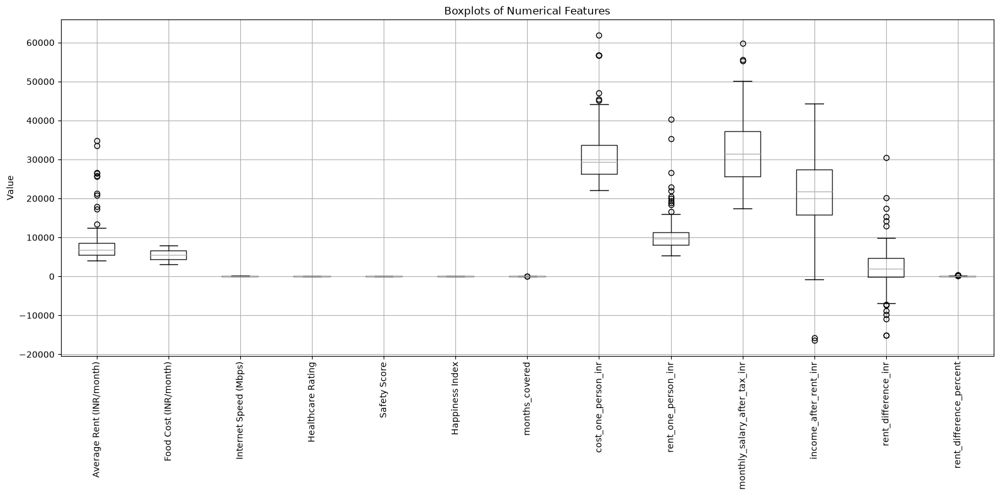
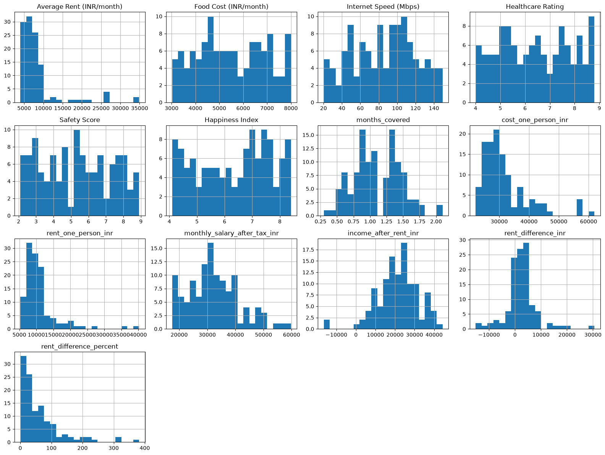
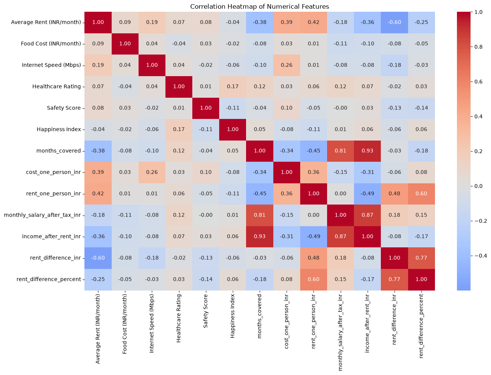
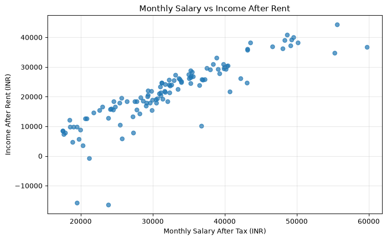
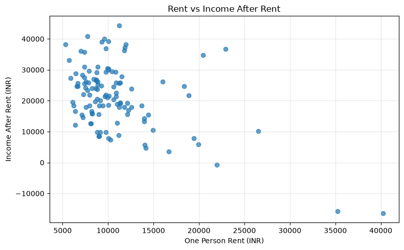
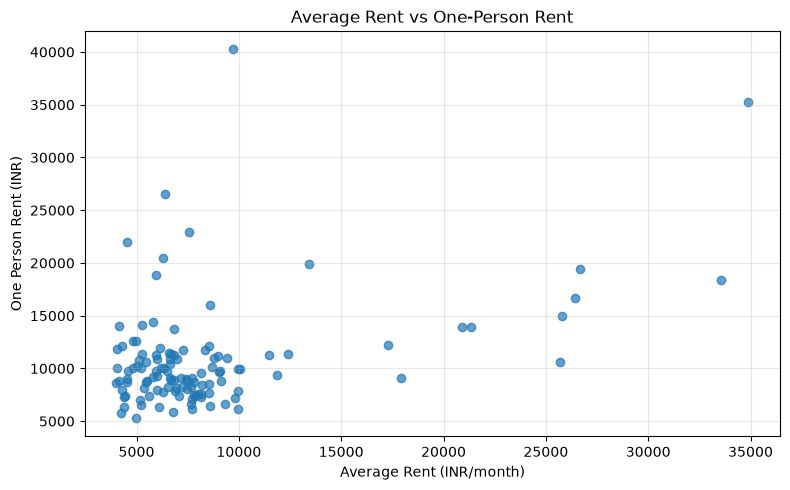
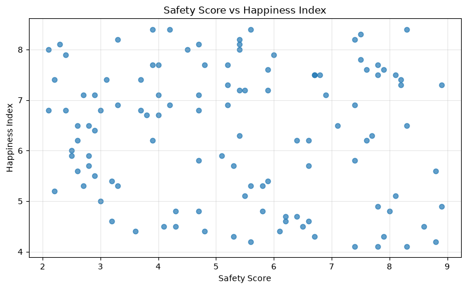

notebook specifically about EDA + understanding the final dataset.

04_EDA.ipynb
│
├── 1. Load processed dataset
├── 2. Basic inspection
│     ├── shape
│     ├── info
│     ├── describe
│     └── unique values
│
├── 3. Univariate Analysis
│     ├── distributions
│     └── boxplots / outliers
│
├── 4. Bivariate Analysis
│     ├── correlations
│     └── important relationships
│
├── 5. Multivariate Analysis
│     └── correlation heatmap
│
└── 6. EDA Findings
      └── what we learned / features to consider


```python
import pandas as pd

df = pd.read_csv("../data/processed/india_cost_quality_merged.csv")

print("Dataset shape:", df.shape)
df.head()
```

    Dataset shape: (116, 14)
    


<div>
<style scoped>
    .dataframe tbody tr th:only-of-type {
        vertical-align: middle;
    }

    .dataframe tbody tr th {
        vertical-align: top;
    }

    .dataframe thead th {
        text-align: right;
    }
</style>
<table border="1" class="dataframe">
  <thead>
    <tr style="text-align: right;">
      <th></th>
      <th>City</th>
      <th>Average Rent (INR/month)</th>
      <th>Food Cost (INR/month)</th>
      <th>Internet Speed (Mbps)</th>
      <th>Healthcare Rating</th>
      <th>Safety Score</th>
      <th>Happiness Index</th>
      <th>months_covered</th>
      <th>cost_one_person_inr</th>
      <th>rent_one_person_inr</th>
      <th>monthly_salary_after_tax_inr</th>
      <th>income_after_rent_inr</th>
      <th>rent_difference_inr</th>
      <th>rent_difference_percent</th>
    </tr>
  </thead>
  <tbody>
    <tr>
      <th>0</th>
      <td>Mumbai</td>
      <td>34896</td>
      <td>6196</td>
      <td>94.48</td>
      <td>6.2</td>
      <td>2.7</td>
      <td>5.3</td>
      <td>0.3</td>
      <td>61943.98</td>
      <td>35233.38</td>
      <td>19505.76</td>
      <td>-15727.62</td>
      <td>337.38</td>
      <td>0.966816</td>
    </tr>
    <tr>
      <th>1</th>
      <td>Delhi</td>
      <td>26424</td>
      <td>4487</td>
      <td>130.26</td>
      <td>6.1</td>
      <td>2.6</td>
      <td>5.6</td>
      <td>0.5</td>
      <td>42965.40</td>
      <td>16694.12</td>
      <td>20296.54</td>
      <td>3602.42</td>
      <td>-9729.88</td>
      <td>36.822131</td>
    </tr>
    <tr>
      <th>2</th>
      <td>Bengaluru</td>
      <td>26667</td>
      <td>6936</td>
      <td>81.36</td>
      <td>8.7</td>
      <td>6.7</td>
      <td>7.5</td>
      <td>0.6</td>
      <td>40680.94</td>
      <td>19417.90</td>
      <td>27325.64</td>
      <td>7907.74</td>
      <td>-7249.10</td>
      <td>27.183785</td>
    </tr>
    <tr>
      <th>3</th>
      <td>Hyderabad</td>
      <td>25785</td>
      <td>6375</td>
      <td>108.84</td>
      <td>7.8</td>
      <td>7.7</td>
      <td>6.3</td>
      <td>0.6</td>
      <td>41295.99</td>
      <td>14936.85</td>
      <td>25480.50</td>
      <td>10543.66</td>
      <td>-10848.15</td>
      <td>42.071553</td>
    </tr>
    <tr>
      <th>4</th>
      <td>Ahmedabad</td>
      <td>20881</td>
      <td>3632</td>
      <td>130.80</td>
      <td>5.5</td>
      <td>7.9</td>
      <td>4.3</td>
      <td>0.7</td>
      <td>38835.80</td>
      <td>13970.34</td>
      <td>27237.78</td>
      <td>13267.43</td>
      <td>-6910.66</td>
      <td>33.095446</td>
    </tr>
  </tbody>
</table>
</div>


```python
df.shape
```


    (116, 14)


```python
df.info()
```

    <class 'pandas.DataFrame'>
    RangeIndex: 116 entries, 0 to 115
    Data columns (total 14 columns):
     #   Column                        Non-Null Count  Dtype  
    ---  ------                        --------------  -----  
     0   City                          116 non-null    str    
     1   Average Rent (INR/month)      116 non-null    int64  
     2   Food Cost (INR/month)         116 non-null    int64  
     3   Internet Speed (Mbps)         116 non-null    float64
     4   Healthcare Rating             116 non-null    float64
     5   Safety Score                  116 non-null    float64
     6   Happiness Index               116 non-null    float64
     7   months_covered                116 non-null    float64
     8   cost_one_person_inr           116 non-null    float64
     9   rent_one_person_inr           116 non-null    float64
     10  monthly_salary_after_tax_inr  116 non-null    float64
     11  income_after_rent_inr         116 non-null    float64
     12  rent_difference_inr           116 non-null    float64
     13  rent_difference_percent       116 non-null    float64
    dtypes: float64(11), int64(2), str(1)
    memory usage: 12.8 KB
    


```python
df.describe()
```


<div>
<style scoped>
    .dataframe tbody tr th:only-of-type {
        vertical-align: middle;
    }

    .dataframe tbody tr th {
        vertical-align: top;
    }

    .dataframe thead th {
        text-align: right;
    }
</style>
<table border="1" class="dataframe">
  <thead>
    <tr style="text-align: right;">
      <th></th>
      <th>Average Rent (INR/month)</th>
      <th>Food Cost (INR/month)</th>
      <th>Internet Speed (Mbps)</th>
      <th>Healthcare Rating</th>
      <th>Safety Score</th>
      <th>Happiness Index</th>
      <th>months_covered</th>
      <th>cost_one_person_inr</th>
      <th>rent_one_person_inr</th>
      <th>monthly_salary_after_tax_inr</th>
      <th>income_after_rent_inr</th>
      <th>rent_difference_inr</th>
      <th>rent_difference_percent</th>
    </tr>
  </thead>
  <tbody>
    <tr>
      <th>count</th>
      <td>116.000000</td>
      <td>116.000000</td>
      <td>116.000000</td>
      <td>116.000000</td>
      <td>116.000000</td>
      <td>116.000000</td>
      <td>116.000000</td>
      <td>116.000000</td>
      <td>116.000000</td>
      <td>116.000000</td>
      <td>116.000000</td>
      <td>116.000000</td>
      <td>116.000000</td>
    </tr>
    <tr>
      <th>mean</th>
      <td>8483.543103</td>
      <td>5503.163793</td>
      <td>85.833190</td>
      <td>6.424138</td>
      <td>5.323276</td>
      <td>6.338793</td>
      <td>1.100862</td>
      <td>31643.086466</td>
      <td>10866.252069</td>
      <td>32318.729397</td>
      <td>21452.477500</td>
      <td>2382.708966</td>
      <td>62.529602</td>
    </tr>
    <tr>
      <th>std</th>
      <td>5685.971878</td>
      <td>1416.506799</td>
      <td>33.809591</td>
      <td>1.433428</td>
      <td>1.992916</td>
      <td>1.311605</td>
      <td>0.357891</td>
      <td>7944.760601</td>
      <td>5173.845961</td>
      <td>9045.532879</td>
      <td>10398.731685</td>
      <td>5875.877700</td>
      <td>69.778630</td>
    </tr>
    <tr>
      <th>min</th>
      <td>4009.000000</td>
      <td>3021.000000</td>
      <td>20.350000</td>
      <td>4.000000</td>
      <td>2.100000</td>
      <td>4.100000</td>
      <td>0.300000</td>
      <td>22053.810000</td>
      <td>5298.190000</td>
      <td>17484.900000</td>
      <td>-16430.530000</td>
      <td>-15176.470000</td>
      <td>0.275110</td>
    </tr>
    <tr>
      <th>25%</th>
      <td>5498.500000</td>
      <td>4397.500000</td>
      <td>58.640000</td>
      <td>5.175000</td>
      <td>3.675000</td>
      <td>5.175000</td>
      <td>0.900000</td>
      <td>26315.207500</td>
      <td>8061.507500</td>
      <td>25722.125000</td>
      <td>15778.142500</td>
      <td>-50.140000</td>
      <td>17.468612</td>
    </tr>
    <tr>
      <th>50%</th>
      <td>6876.000000</td>
      <td>5439.000000</td>
      <td>90.105000</td>
      <td>6.350000</td>
      <td>5.400000</td>
      <td>6.500000</td>
      <td>1.100000</td>
      <td>29346.510000</td>
      <td>9708.950000</td>
      <td>31499.175000</td>
      <td>21803.400000</td>
      <td>1991.080000</td>
      <td>37.738693</td>
    </tr>
    <tr>
      <th>75%</th>
      <td>8580.000000</td>
      <td>6716.000000</td>
      <td>110.657500</td>
      <td>7.700000</td>
      <td>6.950000</td>
      <td>7.500000</td>
      <td>1.300000</td>
      <td>33717.737500</td>
      <td>11378.362500</td>
      <td>37320.147500</td>
      <td>27336.627500</td>
      <td>4642.207500</td>
      <td>84.882910</td>
    </tr>
    <tr>
      <th>max</th>
      <td>34896.000000</td>
      <td>7999.000000</td>
      <td>149.460000</td>
      <td>8.800000</td>
      <td>8.900000</td>
      <td>8.400000</td>
      <td>2.100000</td>
      <td>61943.980000</td>
      <td>40241.620000</td>
      <td>59747.380000</td>
      <td>44371.220000</td>
      <td>30544.620000</td>
      <td>382.026553</td>
    </tr>
  </tbody>
</table>
</div>


```python
df.isnull().sum()
```


    City                            0
    Average Rent (INR/month)        0
    Food Cost (INR/month)           0
    Internet Speed (Mbps)           0
    Healthcare Rating               0
    Safety Score                    0
    Happiness Index                 0
    months_covered                  0
    cost_one_person_inr             0
    rent_one_person_inr             0
    monthly_salary_after_tax_inr    0
    income_after_rent_inr           0
    rent_difference_inr             0
    rent_difference_percent         0
    dtype: int64


```python
numeric_cols = df.select_dtypes(include="number").columns

outlier_summary = []

for col in numeric_cols:
    Q1 = df[col].quantile(0.25)
    Q3 = df[col].quantile(0.75)
    IQR = Q3 - Q1

    lower = Q1 - 1.5 * IQR
    upper = Q3 + 1.5 * IQR

    outliers = df[(df[col] < lower) | (df[col] > upper)]

    outlier_summary.append({
        "Feature": col,
        "Q1": Q1,
        "Q3": Q3,
        "Lower Bound": lower,
        "Upper Bound": upper,
        "Outlier Count": len(outliers)
    })

outlier_df = pd.DataFrame(outlier_summary)

outlier_df.sort_values(
    "Outlier Count",
    ascending=False
)
```


<div>
<style scoped>
    .dataframe tbody tr th:only-of-type {
        vertical-align: middle;
    }

    .dataframe tbody tr th {
        vertical-align: top;
    }

    .dataframe thead th {
        text-align: right;
    }
</style>
<table border="1" class="dataframe">
  <thead>
    <tr style="text-align: right;">
      <th></th>
      <th>Feature</th>
      <th>Q1</th>
      <th>Q3</th>
      <th>Lower Bound</th>
      <th>Upper Bound</th>
      <th>Outlier Count</th>
    </tr>
  </thead>
  <tbody>
    <tr>
      <th>11</th>
      <td>rent_difference_inr</td>
      <td>-50.140000</td>
      <td>4642.20750</td>
      <td>-7088.661250</td>
      <td>11680.728750</td>
      <td>13</td>
    </tr>
    <tr>
      <th>8</th>
      <td>rent_one_person_inr</td>
      <td>8061.507500</td>
      <td>11378.36250</td>
      <td>3086.225000</td>
      <td>16353.645000</td>
      <td>11</td>
    </tr>
    <tr>
      <th>0</th>
      <td>Average Rent (INR/month)</td>
      <td>5498.500000</td>
      <td>8580.00000</td>
      <td>876.250000</td>
      <td>13202.250000</td>
      <td>11</td>
    </tr>
    <tr>
      <th>7</th>
      <td>cost_one_person_inr</td>
      <td>26315.207500</td>
      <td>33717.73750</td>
      <td>15211.412500</td>
      <td>44821.532500</td>
      <td>8</td>
    </tr>
    <tr>
      <th>12</th>
      <td>rent_difference_percent</td>
      <td>17.468612</td>
      <td>84.88291</td>
      <td>-83.652836</td>
      <td>186.004358</td>
      <td>8</td>
    </tr>
    <tr>
      <th>9</th>
      <td>monthly_salary_after_tax_inr</td>
      <td>25722.125000</td>
      <td>37320.14750</td>
      <td>8325.091250</td>
      <td>54717.181250</td>
      <td>3</td>
    </tr>
    <tr>
      <th>6</th>
      <td>months_covered</td>
      <td>0.900000</td>
      <td>1.30000</td>
      <td>0.300000</td>
      <td>1.900000</td>
      <td>2</td>
    </tr>
    <tr>
      <th>10</th>
      <td>income_after_rent_inr</td>
      <td>15778.142500</td>
      <td>27336.62750</td>
      <td>-1559.585000</td>
      <td>44674.355000</td>
      <td>2</td>
    </tr>
    <tr>
      <th>1</th>
      <td>Food Cost (INR/month)</td>
      <td>4397.500000</td>
      <td>6716.00000</td>
      <td>919.750000</td>
      <td>10193.750000</td>
      <td>0</td>
    </tr>
    <tr>
      <th>4</th>
      <td>Safety Score</td>
      <td>3.675000</td>
      <td>6.95000</td>
      <td>-1.237500</td>
      <td>11.862500</td>
      <td>0</td>
    </tr>
    <tr>
      <th>3</th>
      <td>Healthcare Rating</td>
      <td>5.175000</td>
      <td>7.70000</td>
      <td>1.387500</td>
      <td>11.487500</td>
      <td>0</td>
    </tr>
    <tr>
      <th>2</th>
      <td>Internet Speed (Mbps)</td>
      <td>58.640000</td>
      <td>110.65750</td>
      <td>-19.386250</td>
      <td>188.683750</td>
      <td>0</td>
    </tr>
    <tr>
      <th>5</th>
      <td>Happiness Index</td>
      <td>5.175000</td>
      <td>7.50000</td>
      <td>1.687500</td>
      <td>10.987500</td>
      <td>0</td>
    </tr>
  </tbody>
</table>
</div>


```python
import os
import matplotlib.pyplot as plt

numeric_cols = df.select_dtypes(include="number").columns

plt.figure(figsize=(16, 8))

df[numeric_cols].boxplot(rot=90)

plt.title("Boxplots of Numerical Features")
plt.ylabel("Value")
plt.tight_layout()

os.makedirs("../visualizations/outliers", exist_ok=True)

plt.savefig("../visualizations/outliers/numerical_features_boxplot.png")
plt.show()
```


    

    


```python
numeric_cols = df.select_dtypes(include="number").columns

df[numeric_cols].hist(
    figsize=(16, 12),
    bins=20
)

plt.tight_layout()
plt.savefig("../visualizations/distributions/numerical_distributions.png")
plt.show()
```


    

    


What this distribution plot tells us

We plotted histograms for all 13 numerical features in our final 116-city dataset.

1. Average Rent (INR/month)

Clearly right-skewed.

Most cities are around ₹4,000–₹10,000, while a few cities have much higher values (Mumbai, etc.).

➡️ This matches what we saw in the boxplot: several high-value outliers.

2. Food Cost (INR/month)

Much more evenly spread, roughly ₹3,000–₹8,000.

➡️ No major skew/outlier problem.

3. Internet Speed

Reasonably spread between ~20–150 Mbps.

➡️ No obvious extreme outliers.

4. Healthcare Rating, Safety Score, Happiness Index

These are bounded rating-type variables.

➡️ Their distributions are fairly spread out and don't show concerning extreme values.

5. months_covered

Mostly between ~0.5 and 1.5, with a few higher values.

➡️ Some mild skew/outliers, which we already detected with IQR.

6. cost_one_person_inr

Right-skewed.

Most cities are around ₹25k–₹35k, but some go beyond ₹50k–₹60k.

➡️ Consistent with the outliers we detected.

7. rent_one_person_inr

Also strongly right-skewed.

Most values are relatively low, with a few cities having very high rent.

➡️ Important feature for our project.

8. monthly_salary_after_tax_inr

Fairly spread out, but with some high-income cities.

➡️ Mild right skew.

9. income_after_rent_inr

This one is interesting.

Most cities are positive, but there are a few cities where it becomes negative.

That means:

estimated post-tax monthly salary − estimated one-person rent < 0

Those cities are potentially very expensive relative to income.

That's highly relevant to SmartShift AI.

10. rent_difference_inr

This is our derived feature:

rent_one_person_inr - Average Rent (INR/month)

It's centered mostly around positive values but has some negative and very high values.

This is not an original dataset feature; we created it during our integration/feature-engineering step.

11. rent_difference_percent

This is the most obviously right-skewed feature.

Most cities are relatively low, while a handful have extremely large percentages.

And remember our earlier finding:

We should not interpret this as a literal percentage increase in rent because the two rent columns come from different sources/definitions.

We're keeping it as a derived comparison feature, not treating it as ground truth.


```python
import seaborn as sns
import matplotlib.pyplot as plt

corr_matrix = df[numeric_cols].corr()

plt.figure(figsize=(14, 10))

sns.heatmap(
    corr_matrix,
    annot=True,
    cmap="coolwarm",
    fmt=".2f",
    center=0
)

plt.title("Correlation Heatmap of Numerical Features")
plt.tight_layout()

plt.savefig(
    "../visualizations/correlations/numerical_correlation_heatmap.png"
)

plt.show()
```


    

    


```python
# We should make 3–4 targeted scatter plots, not 20 random ones.

# I'd choose:

# Plot 1

# Monthly Salary vs Income After Rent

# Because correlation = 0.87

# Plot 2

# Rent vs Income After Rent

# Because correlation = -0.49

# Plot 3

# Average Rent vs One-Person Rent

# Because correlation = 0.42

# Plot 4

# Safety Score vs Happiness Index

# Because this tests an intuitive assumption even though correlation is weak
```


```python
import matplotlib.pyplot as plt

relationships = [
    (
        "monthly_salary_after_tax_inr",
        "income_after_rent_inr",
        "Monthly Salary vs Income After Rent",
        "Monthly Salary After Tax (INR)",
        "Income After Rent (INR)",
        "salary_vs_income_after_rent.png"
    ),
    (
        "rent_one_person_inr",
        "income_after_rent_inr",
        "Rent vs Income After Rent",
        "One Person Rent (INR)",
        "Income After Rent (INR)",
        "rent_vs_income_after_rent.png"
    ),
    (
        "Average Rent (INR/month)",
        "rent_one_person_inr",
        "Average Rent vs One-Person Rent",
        "Average Rent (INR/month)",
        "One Person Rent (INR)",
        "average_rent_vs_one_person_rent.png"
    ),
    (
        "Safety Score",
        "Happiness Index",
        "Safety Score vs Happiness Index",
        "Safety Score",
        "Happiness Index",
        "safety_vs_happiness.png"
    )
]

for x, y, title, xlabel, ylabel, filename in relationships:

    plt.figure(figsize=(8, 5))

    plt.scatter(df[x], df[y], alpha=0.7)

    plt.title(title)
    plt.xlabel(xlabel)
    plt.ylabel(ylabel)
    plt.grid(True, alpha=0.3)

    plt.tight_layout()
    plt.savefig(f"../visualizations/relationships/{filename}")
    plt.show()
```


    

    


    

    


    

    


    

    


```python
df.columns
```


    Index(['City', 'Average Rent (INR/month)', 'Food Cost (INR/month)',
           'Internet Speed (Mbps)', 'Healthcare Rating', 'Safety Score',
           'Happiness Index', 'months_covered', 'cost_one_person_inr',
           'rent_one_person_inr', 'monthly_salary_after_tax_inr',
           'income_after_rent_inr', 'rent_difference_inr',
           'rent_difference_percent'],
          dtype='str')


